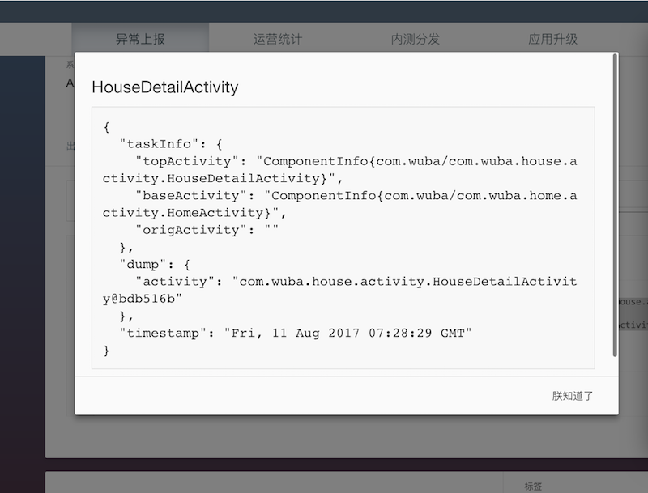

Tango助手基于Chrome Extension技术开发，可以在我们查阅bug详情时，自动提取并解析上传到bugly上的定制信息。
他的好处在于：

- RD分析bug日志的时候，不需要理解我们定制信息背后的协议格式和字段含义；
- 整个提取过程是自动处理的，并可以通过UI界面将核心数据展示出来；


### 版本

版本号 | 时间 | 备注
------------ | ------------- | ------------
[v0.0.1](data/tango_v0.0.1.crx) | 2017-08-23  | 基础扩展，支持详情页面自动提取日志并展示
[v0.0.2](data/tango_v0.0.2.crx) | 2017-09-18  | 修复link地址失效  

### 安装

安装Tango助手，需要先下载crx安装包，然后从本地安装。

```
众所周知原因，需要科学上网才能使用Chrome App Store，我们目前并没有将扩展发布至App Store，因此本地下载安装是唯一方式。
```

[下载Tango助手](data/tango_v0.0.1.crx)

如图所示，直接拖拽下载到的crx至 `chrome://extensions` 页面下即可执行安装操作。


安装完毕后，可以在当前列表内看到如下效果：


### 使用

默认情况下当跟踪页面下的自定义日志有我们上传的日志时，chrome的工具栏右上角的按钮会激活并处于可用状态，点击按钮，会弹出详细的日志信息：


除了右上角之外，你也可以自行选中日志，然后通过右键“提取日志”来解析数据。


