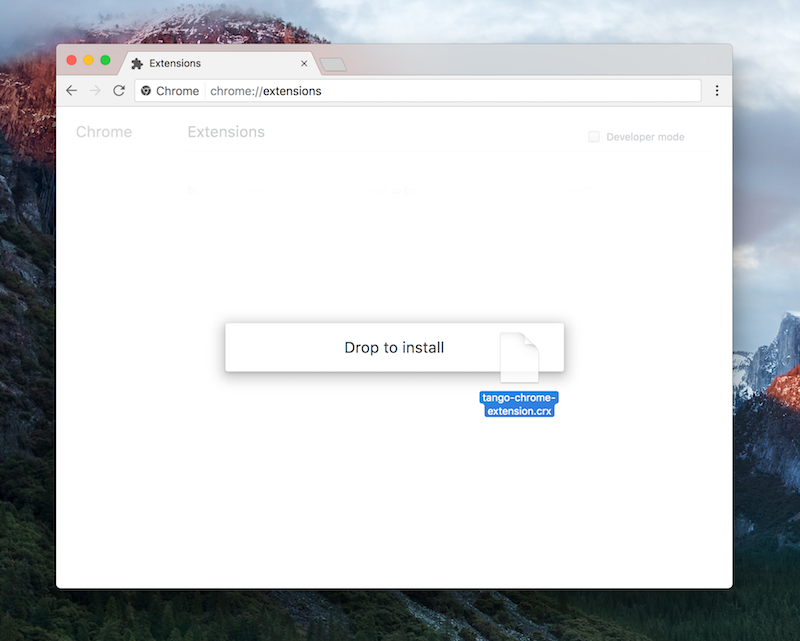
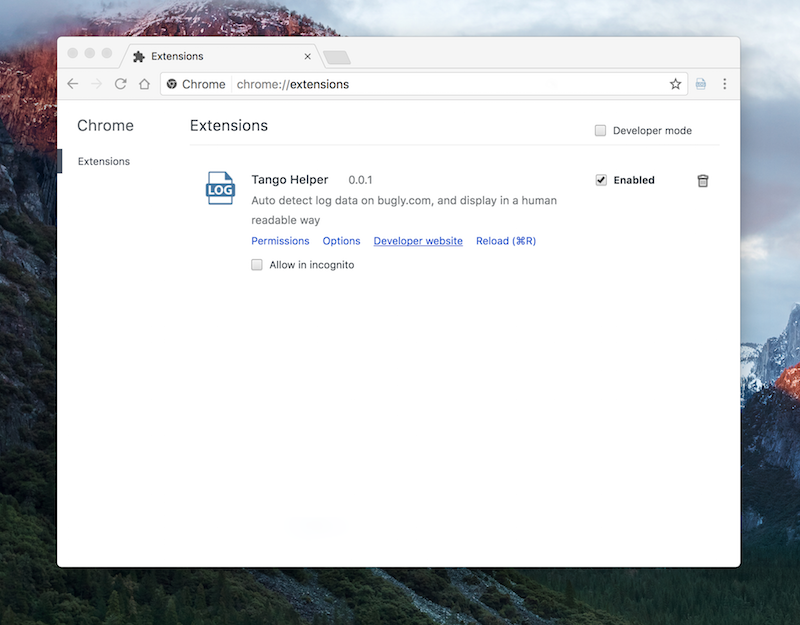
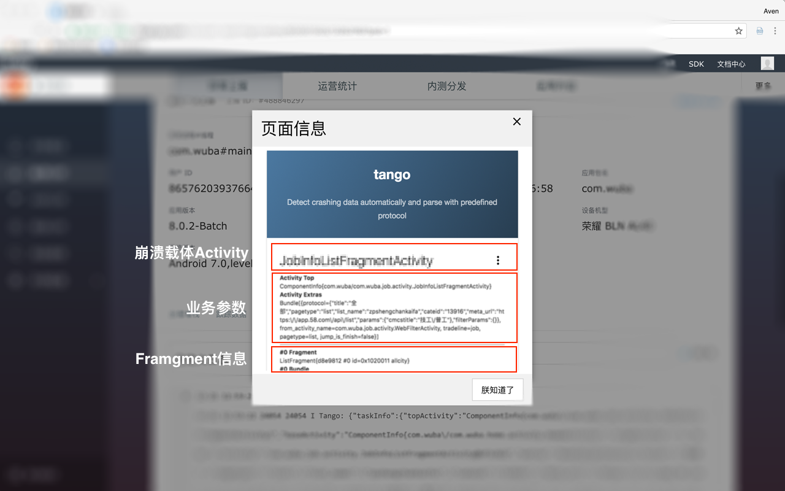
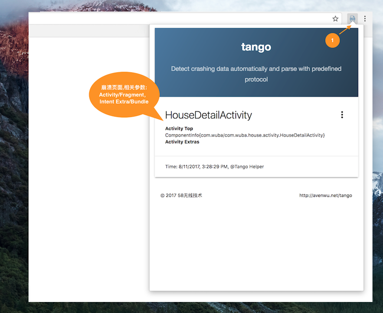

Tango助手基于Chrome Extension技术开发，可以在我们查阅bug详情时，自动提取并解析上传到bugly上的定制信息。
他的好处在于：

- RD分析bug日志的时候，不需要理解我们定制信息背后的协议格式和字段含义；
- 整个提取过程是自动处理的，并可以通过UI界面将核心数据展示出来；

### 版本

版本号 | 时间 | 备注
------------ | ------------- | ------------
[v0.1.1](data/tango_v0.1.1.crx) | 2017-12-27  | 1.重构弹窗提示；2.更新自动匹配规则；3.发布至Web Store  
[v0.0.2](data/tango_v0.0.2.crx) | 2017-09-18  | 修复link地址失效  
[v0.0.1](data/tango_v0.0.1.crx) | 2017-08-23  | 基础扩展，支持详情页面自动提取日志并展示

### 安装

推荐使用`Chrome Web Store`安装:
[Tango](https://chrome.google.com/webstore/detail/tango%E5%8A%A9%E6%89%8B/ajbggbknkpkoehfmnjjebeonbjedlgmm?utm_source=chrome-ntp-icon)

```
众所周知的原因，需要科学上网才能访问Chrome Web Store。
```

<video autoplay="autoplay" width="100%" height="auto" loop="loop" controls="">
<source src="http://7u2jir.com1.z0.glb.clouddn.com/img/tango-helper介绍视频.mov" type="video/mp4">
您的浏览器不支持 video 标签。
</video>

如果无法访问Web Store，则通过手工安装：需要先下载crx安装包，然后从本地安装。

[下载Tango助手](data/tango_v0.1.1.crx)

>
SHA1: becfee0263a59eb0c051b31011f185f60a4d45d1

如图所示，直接拖拽下载到的crx至 `chrome://extensions` 页面下即可执行安装操作。



安装完毕后，可以在当前列表内看到如下效果：



### 使用

支持三种显示日志方式：

1. 自动弹窗提醒；可通过设置，取消自动弹窗提醒（默认开启）
2. 通过过右上角按钮查看日志详情面板
3. 选择日志并右键“提取日志”

默认情况下当`跟踪日志`页面下的自定义日志有我们上传的日志时，chrome的工具栏右上角的按钮会激活并处于可用状态，并且默认会弹出日志提示框：



可以通过设置选项关闭，默认弹窗；同通过点击右上角按钮来主动查看详细的日志信息



处置之外，你也可以自行选中日志，然后通过右键“提取日志”来解析数据。